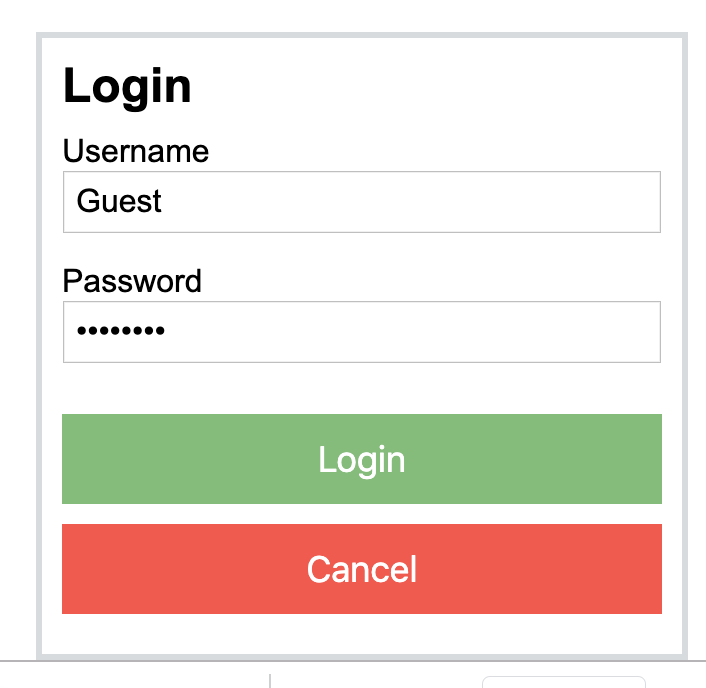
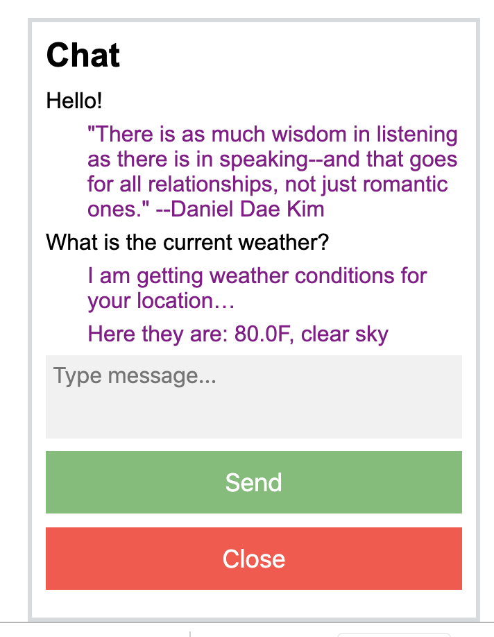

# Simple Automated Web Chat

## Description of the application
The web chat application is built using Node.js and WebSocket. It has a skeleton automatic reply functionality that could be significantly expanded to allow for robotic chat interactions with users (providing canned answers and the like).

There is a login UI, but no user authentication (as the username and password are transmitted to the back end, it could be adapted to an existing authentication functionality of the host app). So, any combination and a username and password will suffice to access the chat app.

When a user's post contains the word "weather", an asynchronous API call is made from the back end to openweathermap.org to get current weather conditions for the user geographical coordinates (user should allow access to his location for this app in the browser). Once the weather data is received, it is pushed to the chat UI.

For all other questions, the app just responds with a randomly-selected quote of a famous person.

In case of user inactivity, the app sends random messages to the chat UI every 30 seconds, and then logs out the user if they been inactive for the period of 5 minutes.

## Instructions on installation and running
- clone the repository
- run "npm install" command in the terminal while in the project folder (there is only one dependency to install - socket.io)
- run "node app.js" command in the terminal
- the app will be running on http://localhost:3000/

Here is a screenshot of the login UI:

  

And here is a screenshot the chat:

  

